# Administrator Guide for the Conference Management System

This document describes how to use the administrative part of the conference management system. It is intended for website administrators responsible for reviewing participant submissions, publishing conference content, editing the public website, managing the conference schedule, and generating conference documents.

## Access to the Administrative Interface

### Open the Admin Area

The entry point to the administrative interface is located in the footer of the public website.

> **Warning:** The admin panel is best used on a desktop or large screen. On smaller screens, the interface may be harder to navigate.

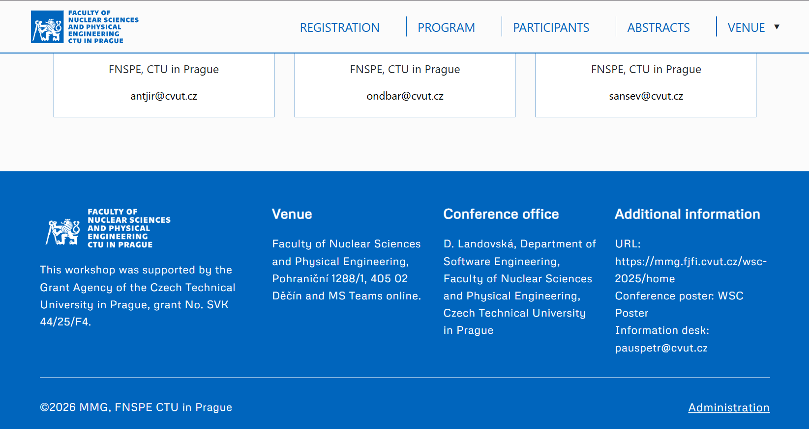

1. Open the public website.
2. Scroll to the footer.
3. Select the administration link.
4. Enter the password known to the website administrators.

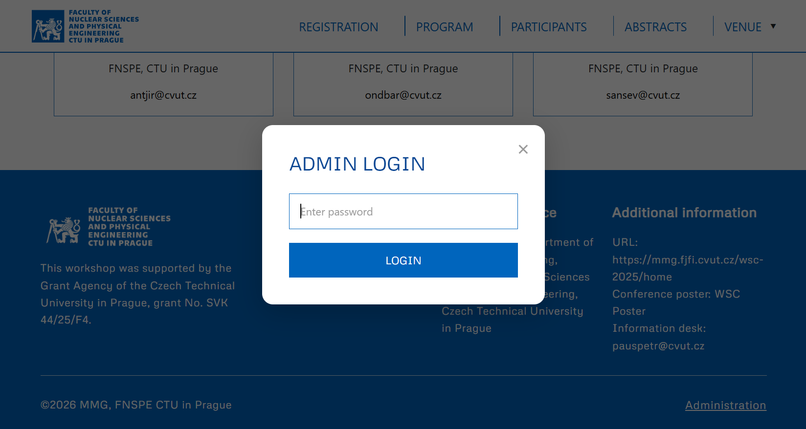

### Leave the Admin Area

You can leave the administrative part of the website in two ways:

- Select **Logout** in the administrative interface.
- Select any section in the public website header.

## Admin Panel Overview

After a successful login, the system opens the administrative panel. The panel contains six main controls:

- Four links to administrative pages with editing and management functions.
- Two buttons for generating documents.

The administrative panel serves as the main navigation hub for all organizer tasks.

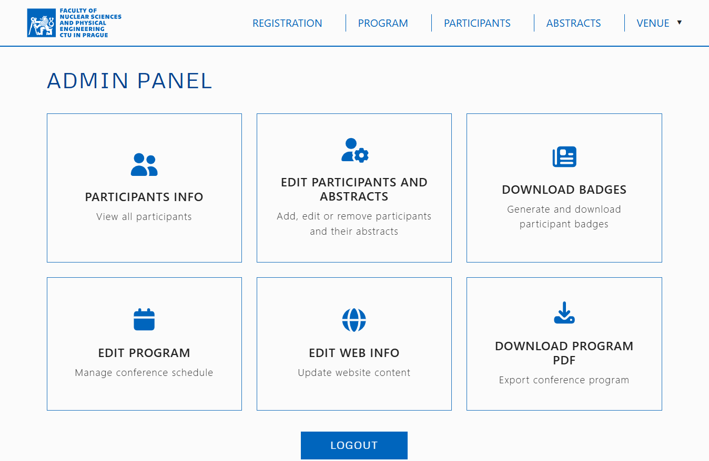

## Participants Info

### Purpose

The first administrative page displays all users who completed the registration form. Its purpose is to provide a clear overview of submitted registrations in a readable format.

### Available Information

Each item displays:

- Participant information.
- Arrival and departure dates.
- Optional comments for administrators.

### Important Note

This page is not interactive. It is intended only for reading information. To modify participant data, use the **Edit Participants and Abstracts** section.

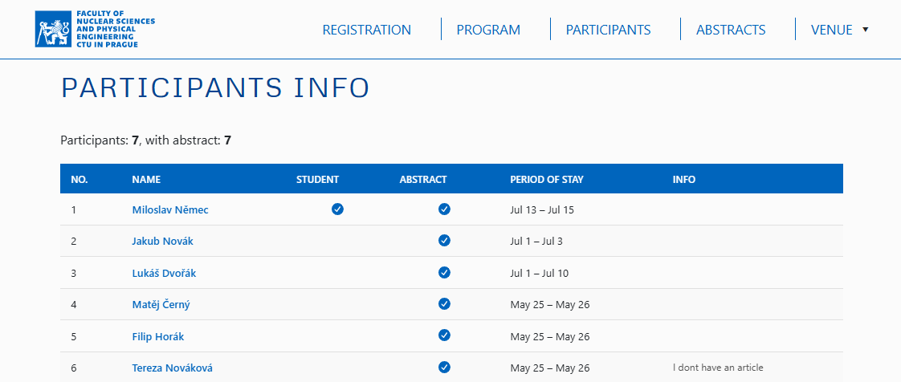

## Edit Participants and Abstracts

### Purpose

The **Edit Participants and Abstracts** section contains the complete information about participant submissions and their abstracts. This section is used for reviewing, editing, publishing, filtering, and deleting submissions.

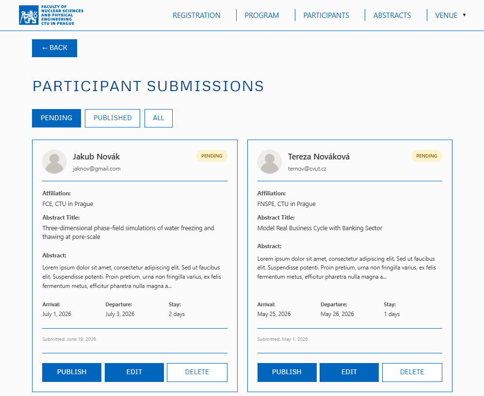

### Open a Participant for Editing

1. Open **Edit Participants and Abstracts**.
2. Find the participant card.
3. Select **Edit** on the participant card.
4. Review or update the participant and abstract data.
5. Confirm the action in the modal window if prompted.

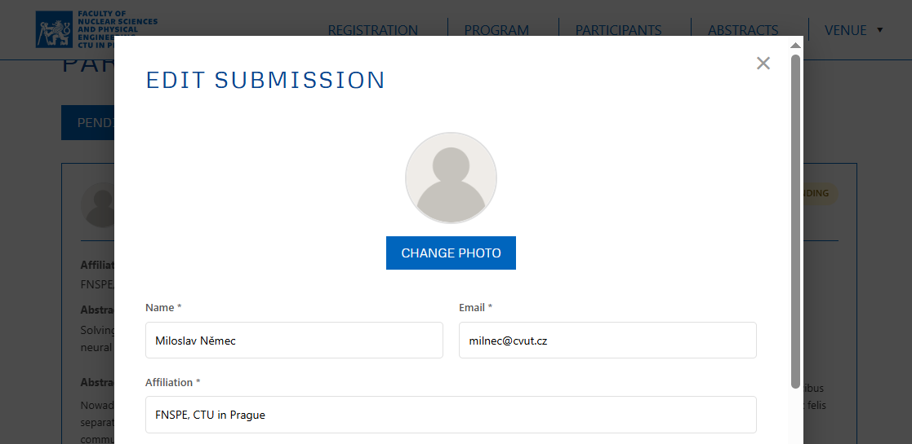

### Publish a Submission

Publishing makes the participant and abstract visible in the public part of the website.

Before publishing, the following fields must be filled in:

- Name
- Affiliation
- Abstract Title
- Abstract Text
- Date of arrival
- Date of departure

To publish a submission:

1. Open **Edit Participants and Abstracts**.
2. Find the required submission.
3. Review the participant and abstract information.
4. Make sure all required fields are completed.
5. Select **Publish**.

### Result of Publication

After publication:

- The participant appears in the public part of the website.
- The abstract appears in the public part of the website.
- The talk is created as an unpublished schedule item without an assigned presentation time.

After publication, the presentation time is still not set. To assign the time, continue to **Edit Program**.

### Edit an Already Published Submission

Published submissions can still be edited.

To find them:

1. Open the filter at the top of the page.
2. Select **Published** or **All**.
3. Find the required participant.
4. Open the record through **Edit**.
5. Save the changes.

Changes made to an already published submission are reflected immediately in the public part of the website.

### Delete a Submission

To delete a submission:

1. Find the required submission.
2. Select **Delete**.
3. Confirm the deletion if the system asks for confirmation.

### Warning

Deletion is irreversible.

Deleting a submission removes the participant information permanently. To restore the removed submission, the registration form must be filled in again from the beginning.

If the deleted submission has already been published, the corresponding participant and abstract are also removed from the public website.

## Edit Program

### Overview

The **Edit Program** section contains two main parts:

- **Unscheduled Talks**
- **Conference Schedule**

This section is used to create conference days, create chairs, assign talks to the schedule, add breaks, and modify already scheduled items.

### Unscheduled Talks Section

The **Unscheduled Talks** section displays published submissions whose presentation time has not yet been assigned.

The **Move to Unscheduled** action moves a talk from the schedule back to the **Unscheduled Talks** section. The talk becomes invisible in the public part of the website until it is assigned again.

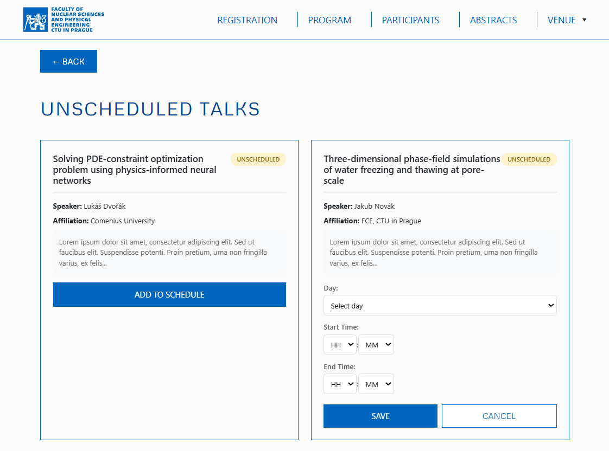

### Assign a Talk to the Schedule

1. Open **Edit Program**.
2. In **Unscheduled Talks**, find the talk that should be scheduled.
3. Select **Add to Schedule**.
4. Select the conference day.
5. Select the chair.
6. Enter the start time.
7. Enter the end time.
8. Select **Save**.

### If the Required Day Does Not Exist

If the needed conference day is missing, create it first in the **Conference Schedule** section using **Add Day**.

### If the Required Chair Does Not Exist

If the needed chair is missing:

1. Verify that the correct conference day is selected.
2. If the correct day is selected and the chair is still missing, create a new chair in the **Conference Schedule** section.

### Conference Schedule Section

The **Conference Schedule** section displays the conference days as separate cards. Each card contains the talks, breaks, and chairs assigned to that day.

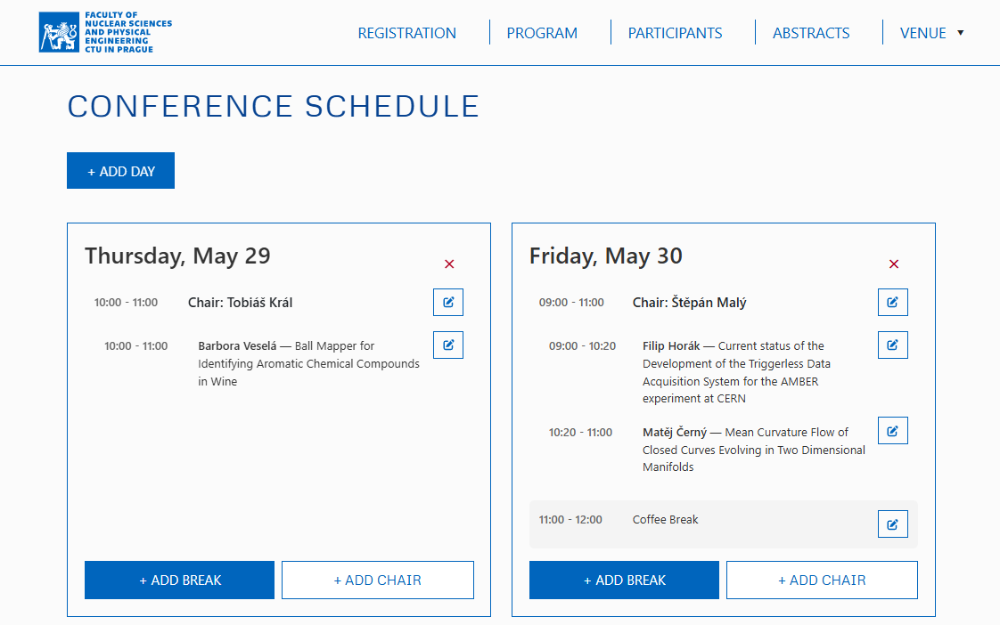

### Add a New Conference Day

1. Open **Edit Program**.
2. In **Conference Schedule**, select **Add Day**.
3. Choose the required date.
4. Select **Save**.

A conference day can be deleted using the cross icon in the upper right corner of the corresponding day card.

### Warning

Before deleting a conference day, make sure that all talks are moved to **Unscheduled Talks**. Otherwise, the talks assigned to that day may be deleted together with it.

### Add a New Chair

1. Find the card of the required conference day.
2. Select **Add Chair** at the bottom of the card.
3. Enter the chair name.
4. Select **Save**.

### Important Note About Chairs

A newly created chair appears in the actual schedule only after at least one talk is assigned to that chair, or after a previously scheduled talk is changed to that chair.

The chair time is calculated automatically from the times of the talks assigned to that chair.

### Edit or Delete a Chair

1. Find the required chair.
2. Select the icon on the right side of the chair.
3. Edit the chair name or delete the chair.

### Result of Chair Deletion

If a chair is deleted, all talks assigned to that chair remain in the system, but they become talks without a chair. They are not deleted and remain visible in the public part of the website.

### Move a Chair to Another Day

To move a chair to another day:

1. Delete the chair from the current day.
2. Create the chair again in the required day.

The talks assigned to that chair are not moved together with the chair. After deletion, they become talks without a chair.

### Add and Edit Breaks

#### Add a Break

A break is used for schedule items that do not have a speaker and are not related to abstracts.

1. Open **Edit Program**.
2. Select **Add Break**.
3. Enter the start time.
4. Enter the end time.
5. Select **Save**.

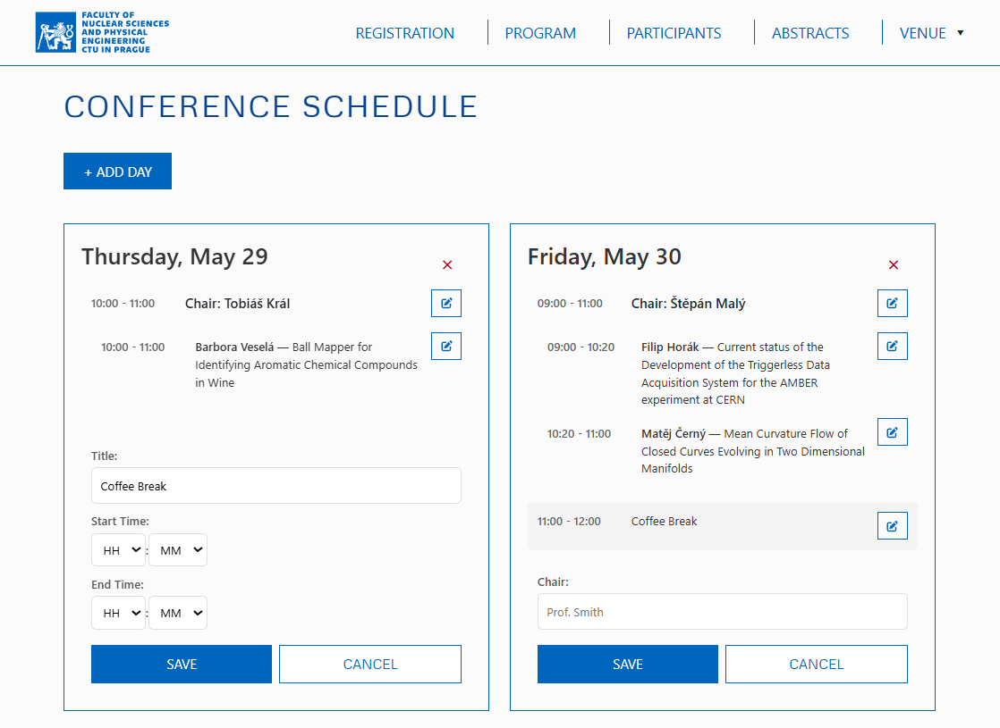

#### Edit a Talk or Break

To change the time or chair of any talk or break:

1. Find the required talk or break.
2. Select the pen icon on the right side.
3. Update the required values.
4. Save the changes.

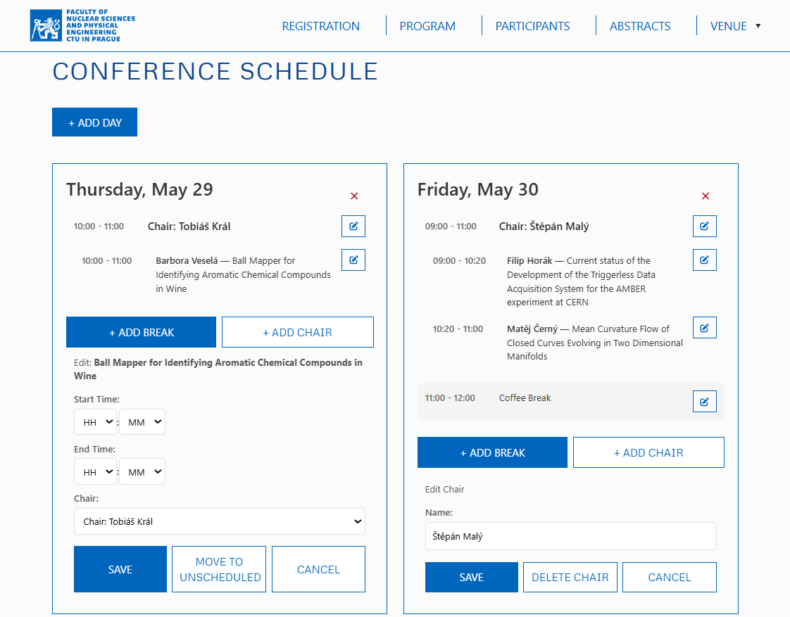

### Important Note About Moving a Talk

To move a talk to another day, select **Move to Unscheduled**. The talk is then moved to the **Unscheduled Talks** section and becomes invisible in the public part of the website. From there, assign it again to the required day, time, and chair.

## Edit Website Information

### Overview

The **Edit Web Info** section is used to update the content displayed in the public part of the application. It is divided into subsections corresponding to the user-facing parts of the website.

### Home Subsection

Use the **Home** subsection to update information displayed on the homepage.

1. Open **Edit Web Info**.
2. Open the **Home** subsection.
3. Change the required information in the input field.
4. Select **Save Changes**.

After saving, the updated information is displayed in the public part of the website.

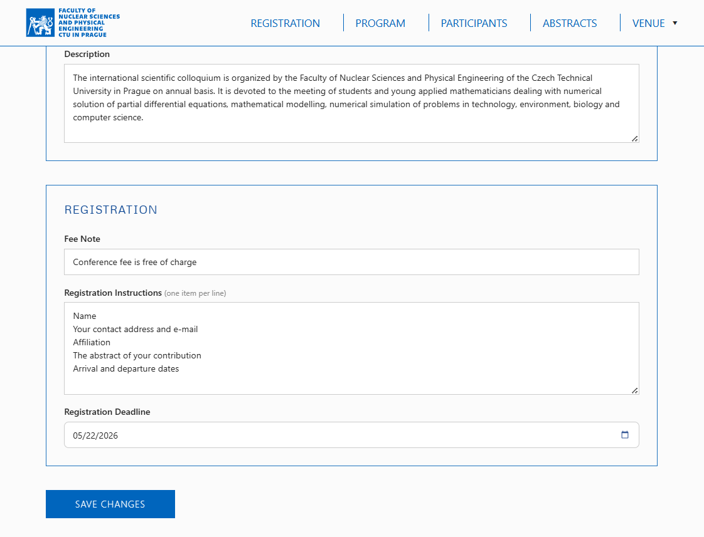

### Organizing Committee and Organizers Cards

These cards allow you to manage person records and photos.

Available actions:

- Change a photo using **Change Photo**.
- Add a new person using **Add Person** at the bottom of the card.
- Delete a person using the cross icon on the right side of the required record.

After making changes, select **Save** at the bottom of the corresponding card. The changes are not applied until the card is saved.

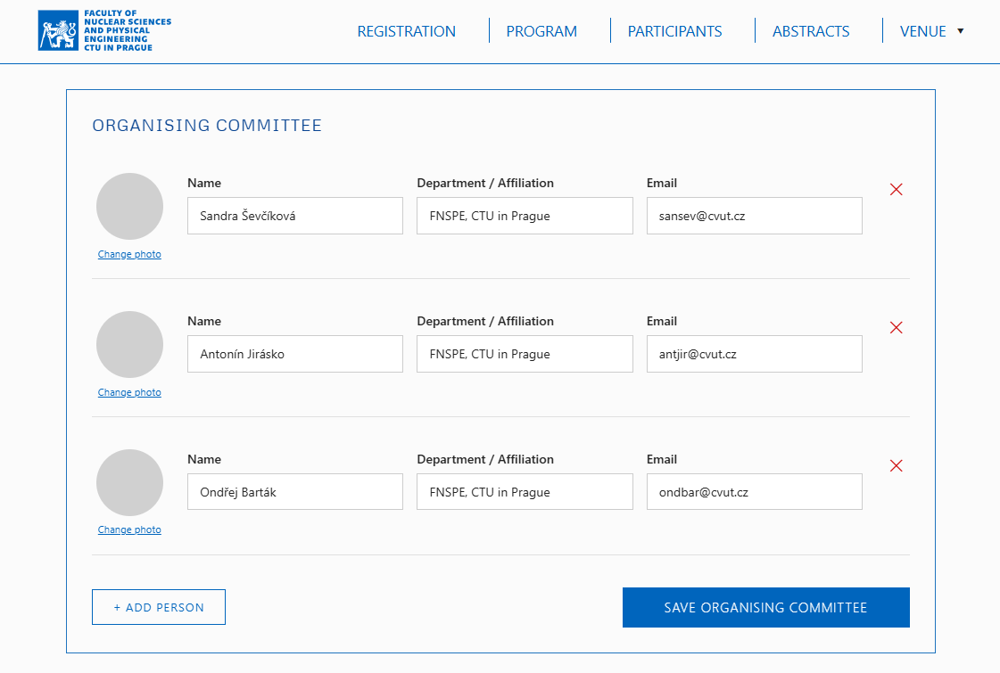

### Registration Subsection

Use the **Registration** subsection to update the registration page text.

1. Open the **Registration** subsection.
2. Modify the relevant input fields.
3. Select **Save**.

### Program Subsection

Use the **Program** subsection to update only the text displayed before the conference schedule.

1. Open the **Program** subsection.
2. Modify the relevant input fields.
3. Select **Save**.

To change the actual schedule, use **Edit Program** in the admin panel instead.

### Venue Subsection

Use the **Venue** subsection to update the venue description and embedded map.

1. Open the **Venue** subsection.
2. Modify the relevant input fields.
3. Select **Save**.

#### Google Maps Embed Instruction

To copy the map link from Google Maps:

1. Open Google Maps.
2. Select **Share**.
3. Select **Embed a map**.
4. Copy the `src` value from the iframe code.
5. Paste it into the appropriate field in the admin interface.

### Accommodation Subsection

Use the **Accommodation** subsection to update the description shown at the top of the accommodation page and to manage accommodation options.

#### Change the Accommodation Description

1. Edit the input field in the accommodation subsection.
2. Select **Save**.

#### Edit Accommodation Options

Each accommodation option card allows you to:

- Edit text inputs.
- Change the photo using **Change Photo**.
- Change the display order using the **Order** input.
- Delete the option using the cross icon.

The option with the lowest order number is shown first on the public website.

#### Add a New Accommodation Option

1. Select **Add Option** at the bottom of the card.
2. Fill in the required information.
3. Save the card.

After all changes, select **Save** at the end of the card.

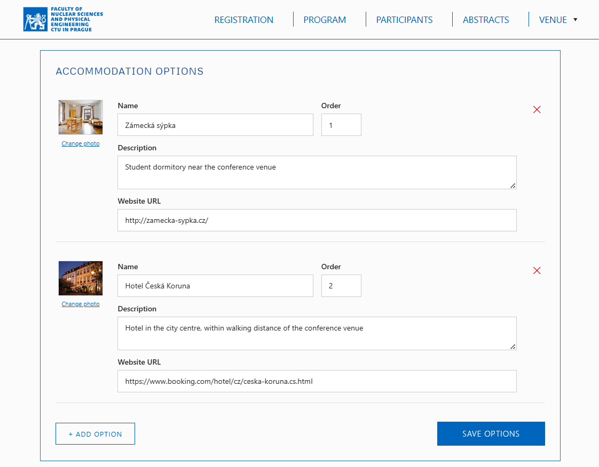

### Hiking Subsection

The **Hiking** subsection is organized into routes, and each route contains several stops.

#### Edit a Route

1. Open the required route card.
2. Change the corresponding input fields.
3. Select **Save Route**.

#### Delete a Route

1. Open the required route card.
2. Select the red **Delete Route** button in the upper right corner.

### Warning

Deleting a route also deletes all stops contained in that route.

#### Add a New Route

Select **Add Route** at the end of the page.

#### Edit Stops

Inside a route, each stop can be updated.

Available actions:

- Edit text inputs.
- Change the photo using **Change Photo**.
- Change the display order using the **Order** input.
- Delete the stop using the cross icon.
- Add a new stop using **Add Stop**.

The stop with the lowest order number is shown first.

After making changes to stops, select **Save** at the end of the card.

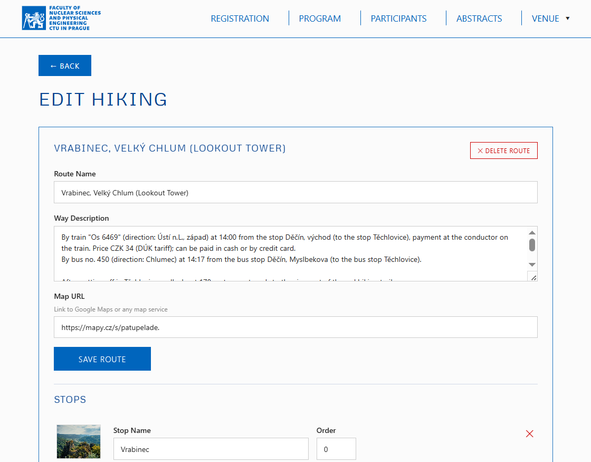

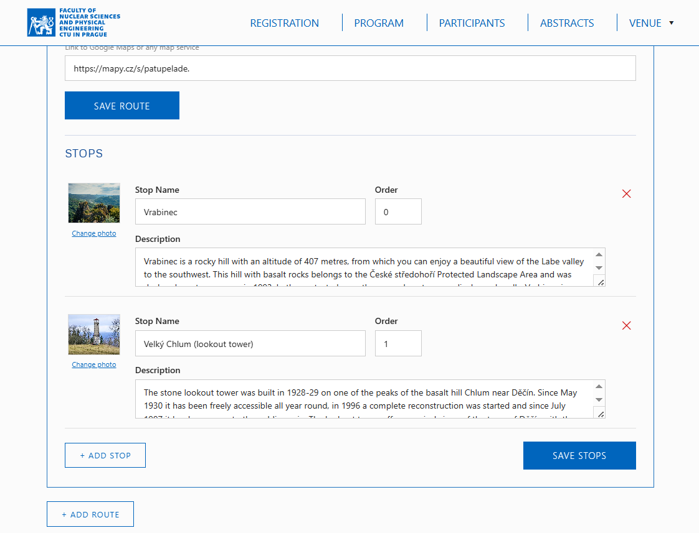

### Footer Subsection

Use the **Footer** subsection to update the information shown in the footer of the website.

1. Open the **Footer** subsection.
2. Modify the required input fields.
3. Select **Save** at the end of the card.

The footer is displayed at the bottom of every public page.

### Generate Documents

The admin panel contains two document-generation buttons:

- **Download Badges**
- **Download Program PDF**

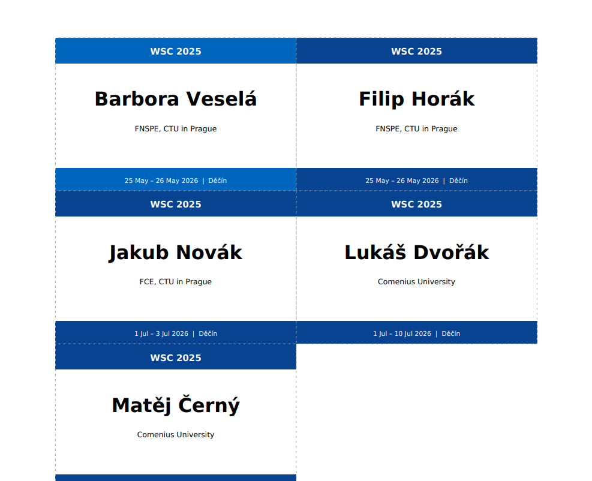

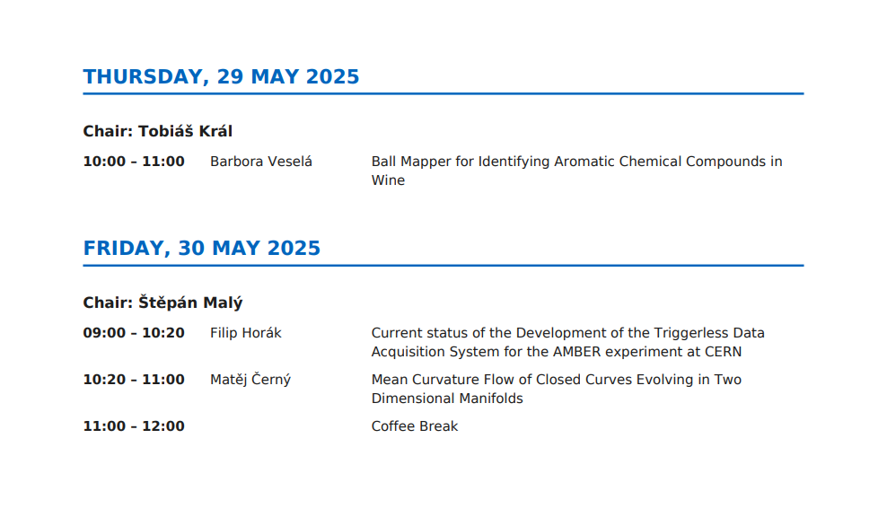

#### Download Badges

When you select **Download Badges**, the system automatically downloads participant badges in PDF format.

The badge data is generated automatically from published submissions. To change badge information, update the corresponding participant data in **Edit Participants and Abstracts**.

#### Download Program PDF

When you select **Download Program PDF**, the system automatically downloads the conference program in PDF format.

The program PDF is generated from the currently published conference schedule. To change the exported program, update the schedule in **Edit Program**.

## Operational Recommendations

### Before Publishing a Submission

Always verify that the following fields are filled in correctly:

- Name
- Affiliation
- Abstract Title
- Abstract Text
- Arrival date
- Departure date

### Before Generating Badges

Make sure all published participant information is correct, because badge data is taken from published submissions.

### Before Generating the Program PDF

Make sure all talks are assigned to the correct days, chairs, and times, because the exported PDF is based on the current published schedule.

## Common Situations

### A Published Participant Is Not Visible in the Program

Publication alone is not enough. After publication, the talk still has no assigned time. Open **Edit Program** and assign the talk in **Unscheduled Talks**.

### The Required Chair Does Not Appear During Scheduling

First verify that the correct conference day is selected. If the day is correct and the chair is still missing, create the chair in **Conference Schedule**.

### Changes on the Public Website Are Not Visible

For content editing pages, check whether the correct **Save** or **Save Changes** button was pressed in the relevant card or subsection.

## Note

This guide covers the standard administrative workflows of the implemented conference management system. If the application is extended in the future, the guide should be updated so that it remains consistent with the current administrative interface.
